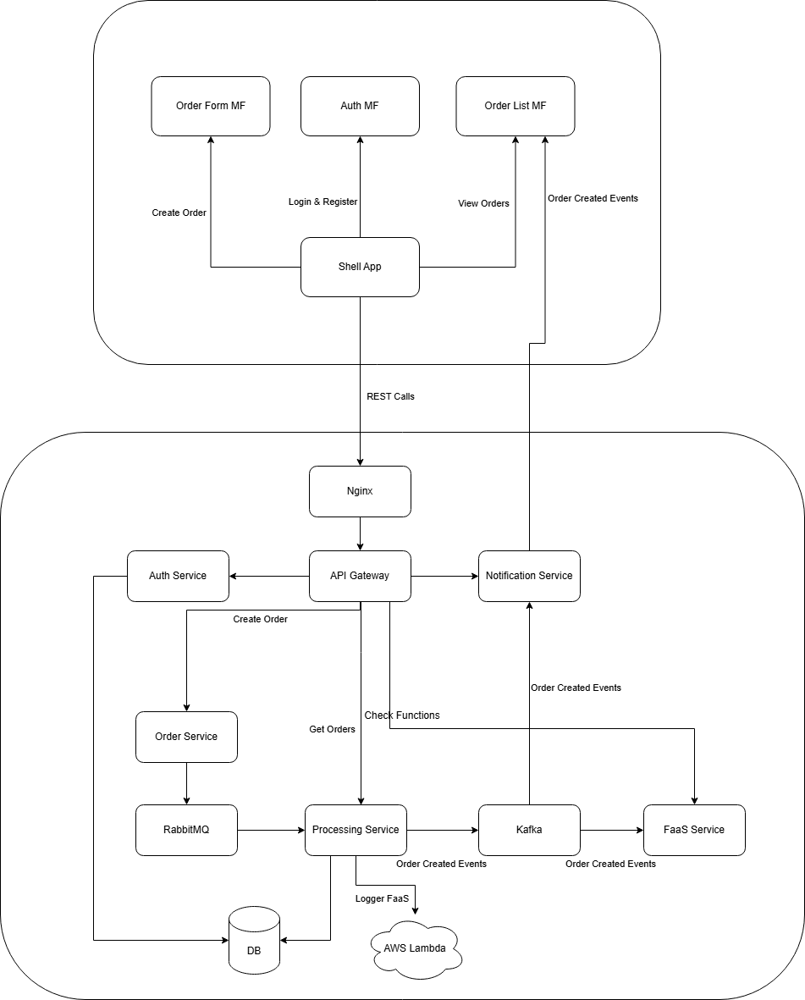

# RabbitMQ Proof of Concept in Java Spring

---

## 1. Purpose of the PoC

This PoC demonstrates how to:

- Build **asynchronous communication** between services
- Use **RabbitMQ** to decouple producers and consumers
- Process messages **reliably** using acknowledgments
- Handle failures without losing data
- Scale consumers independently

---

## 2. High-Level Architecture

### Components

- **Order Service (Producer)**  
  Accepts HTTP requests and publishes messages to RabbitMQ.

- **RabbitMQ (Message Broker)**  
  Buffers, routes, and delivers messages between services.

- **Processing Service (Consumer)**  
  Consumes messages asynchronously and processes orders.

- **Database**  
  Persists processed orders and supports idempotency.

### Message Flow
```
┌─────────────┐      ┌──────────────┐      ┌────────────────────┐
│   Client    │─────>│Order Service │─────>│     RabbitMQ       │
│  (HTTP)     │      │  (Producer)  │      │  Message Broker    │
└─────────────┘      └──────────────┘      └────────────────────┘
                                                      │
                                                      ↓
                                            ┌────────────────────┐
                                            │Processing Service  │
                                            │   (Consumer)       │
                                            └────────────────────┘
                                                      │
                                                      ↓
                                            ┌────────────────────┐
                                            │    PostgreSQL      │
                                            │    Database        │
                                            └────────────────────┘
```
1. Client sends an HTTP request to create an order
2. Order Service validates the request
3. Order Service publishes a message to RabbitMQ
4. RabbitMQ stores the message in a queue
5. Processing Service consumes the message
6. Business logic is executed
7. Result is persisted
8. Message is acknowledged and removed from the queue

---

## 3. RabbitMQ Concepts Used

### Exchange
- Routes messages to queues
- A **Direct Exchange** is used
- Routing is based on an exact routing key match

### Queue
- Stores messages until consumed
- Durable to survive broker restarts
- Can have multiple consumers

### Routing Key
- Identifies the message type (e.g., `order.created`)

### Producer
- Publishes messages to an exchange
- Does not know who consumes the message

### Consumer
- Listens to a queue
- Processes messages independently

### Manual Acknowledgment (ACK)
- Message is removed only after successful processing
- Prevents message loss if a consumer crashes

### Dead Letter Queue (DLQ)
- Stores messages that fail repeatedly
- Prevents infinite retry loops
- Allows inspection and debugging

---

## 4. Step-by-Step Implementation Guide

### Step 1: Create Two Spring Boot Applications

Create two independent Java services:

- **Order Service**  
  - Exposes REST endpoints  
  - Publishes messages to RabbitMQ

- **Processing Service**  
  - Listens to a RabbitMQ queue  
  - Executes business logic

---

### Step 2: Define the Message Contract

Define a shared message structure representing an order:

- Order ID
- Customer ID
- Product ID
- Quantity
- Price
- Timestamp

This message is the **contract** between producer and consumer.

---

### Step 3: Configure RabbitMQ

Both services must agree on:

- Exchange name
- Queue name
- Routing key

Producer responsibilities:
- Declare exchange and queue
- Bind queue to exchange
- Configure a Dead Letter Queue

```java
@Configuration
public class RabbitMQConfig {

    @Value("${rabbitmq.exchange}")
    private String exchange;

    @Value("${rabbitmq.queue}")
    private String queue;

    @Value("${rabbitmq.routing-key}")
    private String routingKey;

    // Dead Letter Queue configuration
    private static final String DLQ_EXCHANGE = "orders.dlx";
    private static final String DLQ_QUEUE = "orders.dlq";

    @Bean
    public DirectExchange exchange() {
        return new DirectExchange(exchange);
    }

    @Bean
    public Queue queue() {
        return QueueBuilder.durable(queue)
                .withArgument("x-dead-letter-exchange", DLQ_EXCHANGE)
                .withArgument("x-dead-letter-routing-key", "order.failed")
                .ttl(300000) // 5 minutes TTL
                .build();
    }

    @Bean
    public Binding binding(Queue queue, DirectExchange exchange) {
        return BindingBuilder.bind(queue).to(exchange).with(routingKey);
    }

    // Dead Letter Queue setup
    @Bean
    public DirectExchange deadLetterExchange() {
        return new DirectExchange(DLQ_EXCHANGE);
    }

    @Bean
    public Queue deadLetterQueue() {
        return QueueBuilder.durable(DLQ_QUEUE).build();
    }

    @Bean
    public Binding deadLetterBinding() {
        return BindingBuilder.bind(deadLetterQueue())
                .to(deadLetterExchange())
                .with("order.failed");
    }

    // JSON message converter
    @Bean
    public MessageConverter jsonMessageConverter() {
        return new JacksonJsonMessageConverter();
    }

    @Bean
    public RabbitTemplate rabbitTemplate(ConnectionFactory connectionFactory) {
        RabbitTemplate template = new RabbitTemplate(connectionFactory);
        template.setMessageConverter(jsonMessageConverter());
        return template;
    }
}
```

Consumer responsibilities:
- Listen to the queue
- Enable manual acknowledgments

```java
@Configuration
public class RabbitMQConfig {

    @Bean
    public MessageConverter jsonMessageConverter() {
        return new JacksonJsonMessageConverter();
    }


    @Bean
    public SimpleRabbitListenerContainerFactory rabbitListenerContainerFactory(
            ConnectionFactory connectionFactory,
            MessageConverter messageConverter
    ) {
        SimpleRabbitListenerContainerFactory factory = new SimpleRabbitListenerContainerFactory();
        factory.setConnectionFactory(connectionFactory);
        factory.setMessageConverter(messageConverter);
        factory.setConcurrentConsumers(1);
        factory.setMaxConcurrentConsumers(3);
        factory.setPrefetchCount(1);
        return factory;
    }
}
```

---

### Step 4: Build the Order Service (Producer)

Responsibilities:

- Accept HTTP requests
- Validate input
- Create an order message
- Publish the message to RabbitMQ

Order Publisher that send messages to RabbitMQ:

```java
public class OrderPublisher {

    private final RabbitTemplate rabbitTemplate;

    @Value("${rabbitmq.exchange}")
    private String exchange;

    @Value("${rabbitmq.routing-key}")
    private String routingKey;

    public void publishOrder(OrderMessage orderMessage) {
        try {
            log.info("Publishing order to queue: orderId={}", orderMessage.getOrderId());

            rabbitTemplate.convertAndSend(exchange, routingKey, orderMessage);

            log.info("Order published successfully: orderId={}", orderMessage.getOrderId());
        } catch (Exception e) {
            log.error("Failed to publish order: orderId={}", orderMessage.getOrderId(), e);
            throw new RuntimeException("Failed to publish order to message queue", e);
        }
    }
}
```

---

### Step 5: Build the Processing Service (Consumer)

Responsibilities:

- Consume messages from RabbitMQ
- Deserialize message payloads
- Execute business logic
- Persist results
- Manually acknowledge messages

The Message Listener with manual acknowledgment and failure handling:
```java
public class OrderMessageListener {

    private final OrderProcessingService orderProcessingService;

    @RabbitListener(queues = "${rabbitmq.queue}", ackMode = "MANUAL")
    public void handleOrderMessage(
            @Payload OrderMessage orderMessage,
            Channel channel,
            @Header(AmqpHeaders.DELIVERY_TAG) long deliveryTag,
            Message message) {

        log.info("Received order message: orderId={}", orderMessage.getOrderId());

        try {
            // Process the order
            orderProcessingService.processOrder(orderMessage);

            // Manually acknowledge the message
            channel.basicAck(deliveryTag, false);
            log.info("Message acknowledged: orderId={}", orderMessage.getOrderId());

        } catch (Exception e) {
            log.error("Error processing order message: orderId={}", orderMessage.getOrderId(), e);

            try {
                // Check if this is a redelivered message
                Boolean redelivered = message.getMessageProperties().getRedelivered();

                if (Boolean.TRUE.equals(redelivered)) {
                    // Message has been redelivered, send to DLQ
                    log.error("Message redelivered, rejecting to DLQ: orderId={}", orderMessage.getOrderId());
                    channel.basicReject(deliveryTag, false); // false = don't requeue
                } else {
                    // First failure, requeue for retry
                    log.warn("First failure, requeuing message: orderId={}", orderMessage.getOrderId());
                    channel.basicNack(deliveryTag, false, true); // true = requeue
                }

            } catch (IOException ioException) {
                log.error("Failed to reject/nack message", ioException);
            }
        }
    }
}
```
---

### Step 6: Docker Configuration for RabbitMQ and the Services

```yaml
  # RabbitMQ Message Broker
  rabbitmq:
    image: rabbitmq:3.12-management
    container_name: rabbitmq
    ports:
      - "5672:5672"   # AMQP port
      - "15672:15672" # Management UI
    environment:
      RABBITMQ_DEFAULT_USER: guest
      RABBITMQ_DEFAULT_PASS: guest
    healthcheck:
      test: rabbitmq-diagnostics -q ping
      interval: 10s
      timeout: 5s
      retries: 5

  # Order Service (Producer)
  order-service:
    build:
      context: ./OrderService
      dockerfile: Dockerfile
    container_name: order-service
    ports:
      - "8081:8081"
    environment:
      SPRING_RABBITMQ_HOST: rabbitmq
      SPRING_RABBITMQ_PORT: 5672
      SPRING_RABBITMQ_USERNAME: guest
      SPRING_RABBITMQ_PASSWORD: guest
      SPRING_PROFILES_ACTIVE: docker
    depends_on:
      rabbitmq:
        condition: service_healthy
    restart: on-failure

  # Processing Service (Consumer)
  processing-service:
    build:
      context: ./ProcessingService
      dockerfile: Dockerfile
    expose:
      - "8082-8084:8082"
    environment:
      SPRING_RABBITMQ_HOST: rabbitmq
      SPRING_RABBITMQ_PORT: 5672
      SPRING_RABBITMQ_USERNAME: guest
      SPRING_RABBITMQ_PASSWORD: guest
      SPRING_DATASOURCE_URL: jdbc:postgresql://postgres:5432/orders_db
      SPRING_DATASOURCE_USERNAME: postgres
      SPRING_DATASOURCE_PASSWORD: postgres
      SPRING_PROFILES_ACTIVE: docker
    depends_on:
      rabbitmq:
        condition: service_healthy
      postgres:
        condition: service_healthy
    restart: on-failure
    deploy:
      mode: replicated
      replicas: 3  # Start 3 instances by default
```
---

## 6. Validating the PoC
After deploying the services and RabbitMQ, you can validate the PoC by sending HTTP requests to the Order Service and 
observing the Processing Service consuming messages, either by checking the container logs, or by using the
RabbitMQ Management UI to monitor the queues and the consumers.

---


